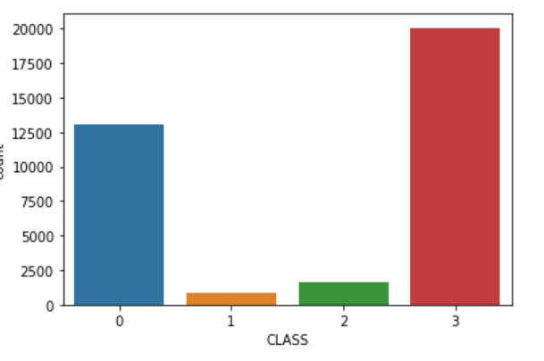
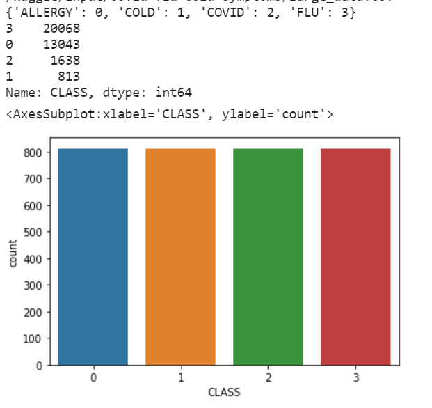

 
<h1 align = "center"> Trabalho Final - INF420 </h1>

<h2 align = "center"> ChatBot para triagem em Hospitais </h2>

## Índice

- [Resumo](#Resumo)
- [Introdução](#Introdução)
- [Metodologia](#Metodologia)
- [Resultados](#Resultados)
- [Conclusão](#Conclusão)
- [Referências](#Referências)
- [Responsáveis](#Responsáveis)

## Resumo
&nbsp;&nbsp;&nbsp;&nbsp;Projeto final apresentado à disciplina de Inteligência Artificial I, de código INF 420, ministrada pelo professor Julio C. S. Reis, como requisito parcial para aprovação na disciplina.

## Introdução
&nbsp;&nbsp;&nbsp;&nbsp;O trabalho proposto é um chatbot responsável por fazer triagem em hospitais para diferenciar os casos de COVID entre os seguintes casos com sintomas semelhantes: alergia, resfriado e gripe. Além disso, no final, ele gera uma ficha médica do paciente com informações pessoais, como nome, idade, profissão, os sintomas, quantos dias ele está doente e resultado da predição feito com técnicas de inteligência artificial. 
 
## Metodologia
&nbsp;&nbsp;&nbsp;&nbsp;Utilizei um <a href="https://www.kaggle.com/datasets/walterconway/covid-flu-cold-symptoms">dataset</a> disponível no Kaggle, com vários casos de enfermidade junto aos seus sintomas e a classificação de cada um dos casos como alergia, resfriado, covid ou gripe. Essa base de dados está desbalanceada, existem muitos casos de alergia em comparação com covid, resfriado e gripe,isso é um problema pois pode gerar muitos "alarmes falsos", o diagnóstico acabaria tendenciando muito para alergia, pois tem muitas amostras e por os sintomas entre as quatro enfermidades serem bem semelhantes, além de dificultar a avaliação de eficácia. Por isso, utilizei a técnica de under-sampling, com o método RandomUnderSampler() da biblioteca imblearn.under_sampling. 
    <figure align="left">
        
        <figcaption>Sem under sampling</figcaption>
    </figure>
    <figure align="right" >
        
        <figcaption>Com under sampling</figcaption>
    </figure>
 
&nbsp;&nbsp;&nbsp;&nbsp;Para resolver o problema de classificação, utilizei duas técnicas: Random Forest e K-Nearest neighbor. Para random forest, coloquei o número de árvores de decisão como 10, com critério entropy de separação e um random_state de 42. Para o K-Nearest neighbor, coloquei um número de vizinhos de 10 e a métrica euclidiana. O treinamento dos modelos estão no arquivo randomforest_knn.py . Depois do treinamento, o programa automaticamente salva os modelos, com auxílio da biblioteca joblib pois eles serão usados para classifição no arquivo chatbot.py. 
&nbsp;&nbsp;&nbsp;&nbsp;Para o desenvolvimento do chatbot, fiz uma rede neural simples, com três camadas densas e duas de dropout, utilizei o Adam como otimizador com um learning rate de 0.01 ,pois foi o melhor otimizador que tinha encontrado quando fiz o trabalho 4 dessa disciplina(testei com o SGD também, porém o desempenho do Adam foi melhor). O treinamento do chatBot é feito no arquivo trainingBot.py e a aplicação do chatBot é feito no arquivo chatBot.py. Tive que fazer o chatbot em inglês, pois utilizei o método WordLemmatizer, da biblioteca nltk, cuja função é agrupar as formas flexionadas de uma palavra para que possam ser analisadas como um único item, por exemplo, no inglês temos várias variações da palavra 'work', como 'works, 'worked', 'working', esse método pega todas essas palavras para serem analisada como 'work', não achei uma maneira fácil de usar esse método na língua portuguesa, logo peço perdão caso encontre algum erro no inglês.  
&nbsp;&nbsp;&nbsp;&nbsp;Para finalizar, o programa chatbot.py, após pegar todos os dados, como informações pessoais e sintomas do paciente, gera um arquivo docx, que seria a ficha médica do paciente.  

## Resultados

## Conclusão

## Referências
https://www.kaggle.com/code/vishakhasinghiitbhu/covid-classifier
https://sigmoidal.ai/como-lidar-com-dados-desbalanceados/
https://www.kaggle.com/datasets/walterconway/covid-flu-cold-symptoms

## Responsáveis
- [Luísa de Souza Ferreira](https://github.com/ferreiraluisa)

