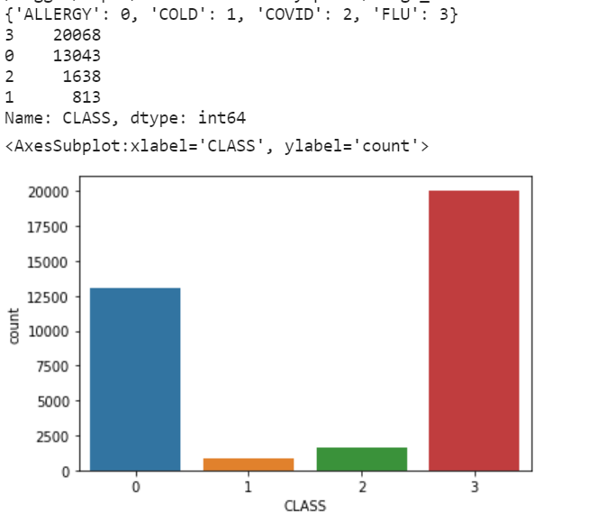

 
<h1 align = "center"> Trabalho Final - INF420 </h1>

<h2 align = "center"> ChatBot para triagem em Hospitais </h2>

## Índice

- [Resumo](#Resumo)
- [Introdução](#Introdução)
- [Metodologia](#Metodologia)
- [Resultados](#Resultados)
- [Conclusão](#Conclusão)
- [Referências](#Referências)
- [Responsáveis](#Responsáveis)

## Resumo
&emsp;&emsp;Projeto final apresentado à disciplina de Inteligência Artificial I, de código INF 420, ministrada pelo professor Julio C. S. Reis, como requisito parcial para aprovação na disciplina.

## Introdução
&emsp;&emsp;O trabalho proposto é um chatbot responsável por fazer triagem em hospitais para diferenciar os casos de COVID entre os seguintes casos com sintomas semelhantes: alergia, resfriado e gripe. Além disso, no final, ele gera uma ficha médica do paciente com informações pessoais, como nome, idade, profissão, os sintomas, quantos dias ele está doente e resultado da predição feito com técnicas de inteligência artificial. 
 
## Metodologia
&emsp;&emsp;Utilizei um <a href="https://www.kaggle.com/datasets/walterconway/covid-flu-cold-symptoms">dataset</a> disponível no Kaggle, com vários casos de enfermidade junto aos seus sintomas e a classificação de cada um dos casos como alergia, resfriado, covid ou gripe. Essa base de dados está desbalanceada, existem muitos casos de alergia e gripe em comparação com covid e resfriado,isso é um problema pois pode gerar muitos "alarmes falsos", o diagnóstico acabaria tendenciando muito para alergia e gripe, pois tem muitas amostras e por os sintomas entre as quatro enfermidades serem bem semelhantes, além de dificultar a avaliação de eficácia. Por isso, utilizei a técnica de under-sampling, com o método RandomUnderSampler() da biblioteca imblearn.under_sampling. 
    <figure align="left">
        
        <figcaption>Sem under sampling</figcaption>
    </figure>
    <figure align="right" >
        
        <figcaption>Com under sampling</figcaption>
    </figure>
 
&emsp;&emsp;Para resolver o problema de classificação, utilizei duas técnicas: Random Forest e K-Nearest neighbor. Para random forest, coloquei o número de árvores de decisão como 10, com critério entropy de separação e um random_state de 42. Para o K-Nearest neighbor, coloquei um número de vizinhos de 10 e a métrica euclidiana. O treinamento dos modelos estão no arquivo randomforest_knn.py . Depois do treinamento, o programa automaticamente salva os modelos, com auxílio da biblioteca joblib pois eles serão usados para classifição no arquivo chatbot.py. 
&emsp;&emsp;Para o desenvolvimento do chatbot, fiz uma rede neural simples, com três camadas densas e duas de dropout, utilizei o Adam como otimizador com um learning rate de 0.01 ,pois foi o melhor otimizador que tinha encontrado quando fiz o trabalho 4 dessa disciplina(testei com o SGD também, porém o desempenho do Adam foi melhor). O treinamento do chatBot é feito no arquivo trainingBot.py e a aplicação do chatBot é feito no arquivo chatBot.py. Tive que fazer o chatbot em inglês, pois utilizei o método WordLemmatizer, da biblioteca nltk, cuja função é agrupar as formas flexionadas de uma palavra para que possam ser analisadas como um único item, por exemplo, no inglês temos várias variações da palavra 'work', como 'works, 'worked', 'working', esse método pega todas essas palavras para serem analisada como 'work', não achei uma maneira fácil de usar esse método na língua portuguesa, logo peço perdão caso encontre algum erro no inglês.  
&emsp;&emsp;Para finalizar, o programa chatbot.py, após pegar todos os dados, como informações pessoais e sintomas do paciente, gera um arquivo docx, que seria a ficha médica do paciente.  

## Resultados
&emsp;&emsp; Em relação ao KNN e ao random forest, escolhi várias métricas para podermos analisarmos a eficácia, para não ter problema de confiarmos em apenas uma e termos uma falsa impressão que o modelo está satisfatório. 
&emsp;&emsp;<bold>Random Forest</bold>: 

<code>
---------------- Random Forest ----------------
              precision    recall  f1-score   support

           0       0.96      0.98      0.97       211
           1       0.93      0.94      0.93       211
           2       0.88      0.93      0.91       211
           3       0.96      0.88      0.92       211

    accuracy                           0.93       844
   macro avg       0.93      0.93      0.93       844
weighted avg       0.93      0.93      0.93       844
</code> 

<figure align="right" >
    
    <figcaption>Matriz de confusão do Random Forest</figcaption>
</figure> 
 
&emsp;&emsp;<bold>K-Nearest neighbor</bold>: 
<code>
---------------- K-Nearest neighbor ----------------
              precision    recall  f1-score   support

           0       1.00      0.87      0.93       211
           1       0.78      1.00      0.88       211
           2       0.77      0.96      0.85       211
           3       1.00      0.60      0.75       211

    accuracy                           0.86       844
   macro avg       0.89      0.86      0.85       844
weighted avg       0.89      0.86      0.85       844
</code>
 
<figure align="right" >
    
    <figcaption>Matriz de confusão do Random Forest</figcaption>
 </figure> 
 
 &emsp;&emsp;Para rede neural utilizada para a construção do chatBot, temos uma acurácia de 96.49% após o treinamento de 200 epócas. 
<code>
Epoch 1/200
12/12 [==============================] - 1s 2ms/step - loss: 2.0987 - accuracy: 0.2105
Epoch 2/200
12/12 [==============================] - 0s 1ms/step - loss: 1.8164 - accuracy: 0.3860
Epoch 3/200
12/12 [==============================] - 0s 2ms/step - loss: 1.6087 - accuracy: 0.4737
Epoch 4/200
12/12 [==============================] - 0s 3ms/step - loss: 1.2902 - accuracy: 0.4912
Epoch 5/200
12/12 [==============================] - 0s 2ms/step - loss: 1.0279 - accuracy: 0.6842
Epoch 6/200
12/12 [==============================] - 0s 2ms/step - loss: 0.8953 - accuracy: 0.6140
Epoch 7/200
12/12 [==============================] - 0s 2ms/step - loss: 0.6933 - accuracy: 0.7544
Epoch 8/200
12/12 [==============================] - 0s 2ms/step - loss: 0.6718 - accuracy: 0.8246
Epoch 9/200
12/12 [==============================] - 0s 1ms/step - loss: 0.2831 - accuracy: 0.8947
Epoch 10/200
12/12 [==============================] - 0s 2ms/step - loss: 0.2084 - accuracy: 0.9123
Epoch 11/200
12/12 [==============================] - 0s 2ms/step - loss: 0.3572 - accuracy: 0.8596
Epoch 12/200
12/12 [==============================] - 0s 1ms/step - loss: 0.1661 - accuracy: 0.9649
Epoch 13/200
12/12 [==============================] - 0s 1ms/step - loss: 0.2430 - accuracy: 0.9474
Epoch 14/200
12/12 [==============================] - 0s 1ms/step - loss: 0.1746 - accuracy: 0.9474
Epoch 15/200
12/12 [==============================] - 0s 1ms/step - loss: 0.2046 - accuracy: 0.9298
Epoch 16/200
12/12 [==============================] - 0s 1ms/step - loss: 0.1263 - accuracy: 0.9474
Epoch 17/200
12/12 [==============================] - 0s 2ms/step - loss: 0.1384 - accuracy: 0.9649
Epoch 18/200
12/12 [==============================] - 0s 1ms/step - loss: 0.1281 - accuracy: 0.9474
Epoch 19/200
12/12 [==============================] - 0s 2ms/step - loss: 0.1031 - accuracy: 0.9649
Epoch 20/200
12/12 [==============================] - 0s 2ms/step - loss: 0.1379 - accuracy: 0.9474
Epoch 21/200
12/12 [==============================] - 0s 2ms/step - loss: 0.2022 - accuracy: 0.9123
Epoch 22/200
12/12 [==============================] - 0s 3ms/step - loss: 0.1114 - accuracy: 0.9649
Epoch 23/200
12/12 [==============================] - 0s 2ms/step - loss: 0.2485 - accuracy: 0.9298
Epoch 24/200
12/12 [==============================] - 0s 2ms/step - loss: 0.0452 - accuracy: 0.9825
Epoch 25/200
12/12 [==============================] - 0s 2ms/step - loss: 0.1832 - accuracy: 0.9474
Epoch 26/200
12/12 [==============================] - 0s 1ms/step - loss: 0.0501 - accuracy: 1.0000
Epoch 27/200
12/12 [==============================] - 0s 2ms/step - loss: 0.1195 - accuracy: 0.9474
Epoch 28/200
12/12 [==============================] - 0s 2ms/step - loss: 0.1188 - accuracy: 0.9474
Epoch 29/200
12/12 [==============================] - 0s 1ms/step - loss: 0.1688 - accuracy: 0.9474
Epoch 30/200
12/12 [==============================] - 0s 2ms/step - loss: 0.1002 - accuracy: 0.9649
Epoch 31/200
12/12 [==============================] - 0s 2ms/step - loss: 0.0630 - accuracy: 0.9825
Epoch 32/200
12/12 [==============================] - 0s 2ms/step - loss: 0.1183 - accuracy: 0.9649
Epoch 33/200
12/12 [==============================] - 0s 2ms/step - loss: 0.2222 - accuracy: 0.9298
Epoch 34/200
12/12 [==============================] - 0s 2ms/step - loss: 0.0624 - accuracy: 0.9649
Epoch 35/200
12/12 [==============================] - 0s 2ms/step - loss: 0.2167 - accuracy: 0.9474
Epoch 36/200
12/12 [==============================] - 0s 2ms/step - loss: 0.2223 - accuracy: 0.9123
Epoch 37/200
12/12 [==============================] - 0s 2ms/step - loss: 0.2093 - accuracy: 0.9474
Epoch 38/200
12/12 [==============================] - 0s 2ms/step - loss: 0.0793 - accuracy: 0.9649
Epoch 39/200
12/12 [==============================] - 0s 2ms/step - loss: 0.4740 - accuracy: 0.8772
Epoch 40/200
12/12 [==============================] - 0s 2ms/step - loss: 0.1221 - accuracy: 0.9649
Epoch 41/200
12/12 [==============================] - 0s 2ms/step - loss: 0.0572 - accuracy: 0.9649
Epoch 42/200
12/12 [==============================] - 0s 2ms/step - loss: 0.0893 - accuracy: 0.9649
Epoch 43/200
12/12 [==============================] - 0s 2ms/step - loss: 0.0842 - accuracy: 0.9474
Epoch 44/200
12/12 [==============================] - 0s 2ms/step - loss: 0.1499 - accuracy: 0.9298
Epoch 45/200
12/12 [==============================] - 0s 2ms/step - loss: 0.0855 - accuracy: 0.9649
Epoch 46/200
12/12 [==============================] - 0s 2ms/step - loss: 0.0332 - accuracy: 0.9825
Epoch 47/200
12/12 [==============================] - 0s 2ms/step - loss: 0.0822 - accuracy: 0.9649
Epoch 48/200
12/12 [==============================] - 0s 2ms/step - loss: 0.0684 - accuracy: 0.9649
Epoch 49/200
12/12 [==============================] - 0s 2ms/step - loss: 0.0383 - accuracy: 0.9825
Epoch 50/200
12/12 [==============================] - 0s 2ms/step - loss: 0.1226 - accuracy: 0.9474
Epoch 51/200
12/12 [==============================] - 0s 2ms/step - loss: 0.1314 - accuracy: 0.9649
Epoch 52/200
12/12 [==============================] - 0s 2ms/step - loss: 0.0416 - accuracy: 0.9825
Epoch 53/200
12/12 [==============================] - 0s 2ms/step - loss: 0.2387 - accuracy: 0.9474
Epoch 54/200
12/12 [==============================] - 0s 2ms/step - loss: 0.1599 - accuracy: 0.9298
Epoch 55/200
12/12 [==============================] - 0s 2ms/step - loss: 0.0801 - accuracy: 0.9649
Epoch 56/200
12/12 [==============================] - 0s 2ms/step - loss: 0.0415 - accuracy: 0.9825
Epoch 57/200
12/12 [==============================] - 0s 2ms/step - loss: 0.2629 - accuracy: 0.9298
Epoch 58/200
12/12 [==============================] - 0s 2ms/step - loss: 0.0926 - accuracy: 0.9474
Epoch 59/200
12/12 [==============================] - 0s 2ms/step - loss: 0.1282 - accuracy: 0.9649
Epoch 60/200
12/12 [==============================] - 0s 2ms/step - loss: 0.0365 - accuracy: 0.9825
Epoch 61/200
12/12 [==============================] - 0s 2ms/step - loss: 0.1657 - accuracy: 0.9474
Epoch 62/200
12/12 [==============================] - 0s 2ms/step - loss: 0.1050 - accuracy: 0.9825
Epoch 63/200
12/12 [==============================] - 0s 1ms/step - loss: 0.0808 - accuracy: 0.9649
Epoch 64/200
12/12 [==============================] - 0s 2ms/step - loss: 0.2026 - accuracy: 0.9298
Epoch 65/200
12/12 [==============================] - 0s 2ms/step - loss: 0.0370 - accuracy: 0.9825
Epoch 66/200
12/12 [==============================] - 0s 2ms/step - loss: 0.0547 - accuracy: 0.9825
Epoch 67/200
12/12 [==============================] - 0s 2ms/step - loss: 0.0409 - accuracy: 0.9825
Epoch 68/200
12/12 [==============================] - 0s 2ms/step - loss: 0.1014 - accuracy: 0.9649
Epoch 69/200
12/12 [==============================] - 0s 2ms/step - loss: 0.0330 - accuracy: 0.9825
Epoch 70/200
12/12 [==============================] - 0s 2ms/step - loss: 0.0747 - accuracy: 0.9649
Epoch 71/200
12/12 [==============================] - 0s 2ms/step - loss: 0.0558 - accuracy: 0.9825
Epoch 72/200
12/12 [==============================] - 0s 2ms/step - loss: 0.0436 - accuracy: 0.9825
Epoch 73/200
12/12 [==============================] - 0s 2ms/step - loss: 0.0419 - accuracy: 0.9825
Epoch 74/200
12/12 [==============================] - 0s 2ms/step - loss: 0.0333 - accuracy: 0.9825
Epoch 75/200
12/12 [==============================] - 0s 1ms/step - loss: 0.0379 - accuracy: 0.9825
Epoch 76/200
12/12 [==============================] - 0s 2ms/step - loss: 0.0596 - accuracy: 0.9825
Epoch 77/200
12/12 [==============================] - 0s 2ms/step - loss: 0.0414 - accuracy: 1.0000
Epoch 78/200
12/12 [==============================] - 0s 1ms/step - loss: 0.0368 - accuracy: 0.9649
Epoch 79/200
12/12 [==============================] - 0s 1ms/step - loss: 0.0484 - accuracy: 0.9825
Epoch 80/200
12/12 [==============================] - 0s 2ms/step - loss: 0.1782 - accuracy: 0.9649
Epoch 81/200
12/12 [==============================] - 0s 2ms/step - loss: 0.0262 - accuracy: 0.9825
Epoch 82/200
12/12 [==============================] - 0s 2ms/step - loss: 0.0762 - accuracy: 0.9649
Epoch 83/200
12/12 [==============================] - 0s 2ms/step - loss: 0.0208 - accuracy: 1.0000
Epoch 84/200
12/12 [==============================] - 0s 2ms/step - loss: 0.0505 - accuracy: 0.9825
Epoch 85/200
12/12 [==============================] - 0s 2ms/step - loss: 0.0340 - accuracy: 0.9825
Epoch 86/200
12/12 [==============================] - 0s 2ms/step - loss: 0.0587 - accuracy: 0.9649
Epoch 87/200
12/12 [==============================] - 0s 2ms/step - loss: 0.0268 - accuracy: 1.0000
Epoch 88/200
12/12 [==============================] - 0s 2ms/step - loss: 0.0244 - accuracy: 0.9825
Epoch 89/200
12/12 [==============================] - 0s 2ms/step - loss: 0.0663 - accuracy: 0.9649
Epoch 90/200
12/12 [==============================] - 0s 2ms/step - loss: 0.0207 - accuracy: 1.0000
Epoch 91/200
12/12 [==============================] - 0s 2ms/step - loss: 0.0692 - accuracy: 0.9825
Epoch 92/200
12/12 [==============================] - 0s 2ms/step - loss: 0.0368 - accuracy: 0.9825
Epoch 93/200
12/12 [==============================] - 0s 2ms/step - loss: 0.0418 - accuracy: 0.9649
Epoch 94/200
12/12 [==============================] - 0s 2ms/step - loss: 0.0345 - accuracy: 1.0000
Epoch 95/200
12/12 [==============================] - 0s 2ms/step - loss: 0.1575 - accuracy: 0.9649
Epoch 96/200
12/12 [==============================] - 0s 2ms/step - loss: 0.0479 - accuracy: 0.9825
Epoch 97/200
12/12 [==============================] - 0s 2ms/step - loss: 0.0499 - accuracy: 0.9649
Epoch 98/200
12/12 [==============================] - 0s 2ms/step - loss: 0.0533 - accuracy: 0.9825
Epoch 99/200
12/12 [==============================] - 0s 2ms/step - loss: 0.0175 - accuracy: 0.9825
Epoch 100/200
12/12 [==============================] - 0s 2ms/step - loss: 0.0483 - accuracy: 0.9825
Epoch 101/200
12/12 [==============================] - 0s 2ms/step - loss: 0.0194 - accuracy: 1.0000
Epoch 102/200
12/12 [==============================] - 0s 2ms/step - loss: 0.0599 - accuracy: 0.9649
Epoch 103/200
12/12 [==============================] - 0s 2ms/step - loss: 0.1937 - accuracy: 0.9474
Epoch 104/200
12/12 [==============================] - 0s 2ms/step - loss: 0.0842 - accuracy: 0.9474
Epoch 105/200
12/12 [==============================] - 0s 2ms/step - loss: 0.0821 - accuracy: 0.9474
Epoch 106/200
12/12 [==============================] - 0s 2ms/step - loss: 0.0658 - accuracy: 0.9825
Epoch 107/200
12/12 [==============================] - 0s 2ms/step - loss: 0.0324 - accuracy: 1.0000
Epoch 108/200
12/12 [==============================] - 0s 2ms/step - loss: 0.0424 - accuracy: 0.9649
Epoch 109/200
12/12 [==============================] - 0s 2ms/step - loss: 0.0565 - accuracy: 0.9649
Epoch 110/200
12/12 [==============================] - 0s 2ms/step - loss: 0.0247 - accuracy: 0.9825
Epoch 111/200
12/12 [==============================] - 0s 2ms/step - loss: 0.0273 - accuracy: 1.0000
Epoch 112/200
12/12 [==============================] - 0s 2ms/step - loss: 0.0410 - accuracy: 0.9825
Epoch 113/200
12/12 [==============================] - 0s 2ms/step - loss: 0.1202 - accuracy: 0.9649
Epoch 114/200
12/12 [==============================] - 0s 2ms/step - loss: 0.0608 - accuracy: 0.9649
Epoch 115/200
12/12 [==============================] - 0s 2ms/step - loss: 0.0319 - accuracy: 0.9825
Epoch 116/200
12/12 [==============================] - 0s 2ms/step - loss: 0.0724 - accuracy: 0.9825
Epoch 117/200
12/12 [==============================] - 0s 2ms/step - loss: 0.0472 - accuracy: 0.9825
Epoch 118/200
12/12 [==============================] - 0s 2ms/step - loss: 0.0421 - accuracy: 0.9825
Epoch 119/200
12/12 [==============================] - 0s 2ms/step - loss: 0.2913 - accuracy: 0.9298
Epoch 120/200
12/12 [==============================] - 0s 2ms/step - loss: 0.0301 - accuracy: 0.9825
Epoch 121/200
12/12 [==============================] - 0s 2ms/step - loss: 0.0455 - accuracy: 0.9825
Epoch 122/200
12/12 [==============================] - 0s 2ms/step - loss: 0.3829 - accuracy: 0.9474
Epoch 123/200
12/12 [==============================] - 0s 2ms/step - loss: 0.0442 - accuracy: 0.9649
Epoch 124/200
12/12 [==============================] - 0s 2ms/step - loss: 0.0404 - accuracy: 0.9825
Epoch 125/200
12/12 [==============================] - 0s 2ms/step - loss: 0.0560 - accuracy: 0.9825
Epoch 126/200
12/12 [==============================] - 0s 2ms/step - loss: 0.0164 - accuracy: 1.0000
Epoch 127/200
12/12 [==============================] - 0s 2ms/step - loss: 0.0183 - accuracy: 1.0000
Epoch 128/200
12/12 [==============================] - 0s 2ms/step - loss: 0.0728 - accuracy: 0.9649
Epoch 129/200
12/12 [==============================] - 0s 2ms/step - loss: 0.0681 - accuracy: 0.9649
Epoch 130/200
12/12 [==============================] - 0s 2ms/step - loss: 0.0150 - accuracy: 1.0000
Epoch 131/200
12/12 [==============================] - 0s 2ms/step - loss: 0.0508 - accuracy: 0.9649
Epoch 132/200
12/12 [==============================] - 0s 1ms/step - loss: 0.0481 - accuracy: 0.9649
Epoch 133/200
12/12 [==============================] - 0s 2ms/step - loss: 0.1014 - accuracy: 0.9649
Epoch 134/200
12/12 [==============================] - 0s 2ms/step - loss: 0.0505 - accuracy: 0.9825
Epoch 135/200
12/12 [==============================] - 0s 2ms/step - loss: 0.0559 - accuracy: 0.9825
Epoch 136/200
12/12 [==============================] - 0s 2ms/step - loss: 0.0507 - accuracy: 0.9825
Epoch 137/200
12/12 [==============================] - 0s 2ms/step - loss: 0.0269 - accuracy: 0.9649
Epoch 138/200
12/12 [==============================] - 0s 2ms/step - loss: 0.0882 - accuracy: 0.9474
Epoch 139/200
12/12 [==============================] - 0s 2ms/step - loss: 0.0891 - accuracy: 0.9825
Epoch 140/200
12/12 [==============================] - 0s 2ms/step - loss: 0.0230 - accuracy: 0.9825
Epoch 141/200
12/12 [==============================] - 0s 2ms/step - loss: 0.0576 - accuracy: 0.9649
Epoch 142/200
12/12 [==============================] - 0s 2ms/step - loss: 0.0482 - accuracy: 0.9825
Epoch 143/200
12/12 [==============================] - 0s 2ms/step - loss: 0.0163 - accuracy: 1.0000
Epoch 144/200
12/12 [==============================] - 0s 2ms/step - loss: 0.0445 - accuracy: 0.9825
Epoch 145/200
12/12 [==============================] - 0s 2ms/step - loss: 0.3375 - accuracy: 0.8772
Epoch 146/200
12/12 [==============================] - 0s 2ms/step - loss: 0.0437 - accuracy: 0.9825
Epoch 147/200
12/12 [==============================] - 0s 2ms/step - loss: 0.0512 - accuracy: 0.9649
Epoch 148/200
12/12 [==============================] - 0s 2ms/step - loss: 0.0281 - accuracy: 0.9825
Epoch 149/200
12/12 [==============================] - 0s 2ms/step - loss: 0.0121 - accuracy: 1.0000
Epoch 150/200
12/12 [==============================] - 0s 2ms/step - loss: 0.2249 - accuracy: 0.9474
Epoch 151/200
12/12 [==============================] - 0s 2ms/step - loss: 0.1654 - accuracy: 0.9474
Epoch 152/200
12/12 [==============================] - 0s 2ms/step - loss: 0.0772 - accuracy: 0.9649
Epoch 153/200
12/12 [==============================] - 0s 2ms/step - loss: 0.0278 - accuracy: 1.0000
Epoch 154/200
12/12 [==============================] - 0s 2ms/step - loss: 0.0227 - accuracy: 0.9825
Epoch 155/200
12/12 [==============================] - 0s 2ms/step - loss: 0.0226 - accuracy: 0.9825
Epoch 156/200
12/12 [==============================] - 0s 2ms/step - loss: 0.0694 - accuracy: 0.9825
Epoch 157/200
12/12 [==============================] - 0s 2ms/step - loss: 0.0307 - accuracy: 0.9825
Epoch 158/200
12/12 [==============================] - 0s 2ms/step - loss: 0.1945 - accuracy: 0.9825
Epoch 159/200
12/12 [==============================] - 0s 2ms/step - loss: 0.0477 - accuracy: 0.9649
Epoch 160/200
12/12 [==============================] - 0s 2ms/step - loss: 0.1765 - accuracy: 0.9474
Epoch 161/200
12/12 [==============================] - 0s 2ms/step - loss: 0.1330 - accuracy: 0.9474
Epoch 162/200
12/12 [==============================] - 0s 2ms/step - loss: 0.0446 - accuracy: 0.9649
Epoch 163/200
12/12 [==============================] - 0s 2ms/step - loss: 0.1298 - accuracy: 0.9649
Epoch 164/200
12/12 [==============================] - 0s 2ms/step - loss: 0.0189 - accuracy: 1.0000
Epoch 165/200
12/12 [==============================] - 0s 2ms/step - loss: 0.1042 - accuracy: 0.9649
Epoch 166/200
12/12 [==============================] - 0s 2ms/step - loss: 0.0739 - accuracy: 0.9649
Epoch 167/200
12/12 [==============================] - 0s 2ms/step - loss: 0.0717 - accuracy: 0.9649
Epoch 168/200
12/12 [==============================] - 0s 2ms/step - loss: 0.0778 - accuracy: 0.9649
Epoch 169/200
12/12 [==============================] - 0s 2ms/step - loss: 0.0766 - accuracy: 0.9474
Epoch 170/200
12/12 [==============================] - 0s 2ms/step - loss: 0.0884 - accuracy: 0.9298
Epoch 171/200
12/12 [==============================] - 0s 2ms/step - loss: 0.1042 - accuracy: 0.9649
Epoch 172/200
12/12 [==============================] - 0s 2ms/step - loss: 0.0323 - accuracy: 1.0000
Epoch 173/200
12/12 [==============================] - 0s 2ms/step - loss: 0.0463 - accuracy: 0.9825
Epoch 174/200
12/12 [==============================] - 0s 2ms/step - loss: 0.0396 - accuracy: 0.9825
Epoch 175/200
12/12 [==============================] - 0s 2ms/step - loss: 0.1167 - accuracy: 0.9649
Epoch 176/200
12/12 [==============================] - 0s 2ms/step - loss: 0.0382 - accuracy: 0.9825
Epoch 177/200
12/12 [==============================] - 0s 2ms/step - loss: 0.0967 - accuracy: 0.9825
Epoch 178/200
12/12 [==============================] - 0s 2ms/step - loss: 0.0786 - accuracy: 0.9474
Epoch 179/200
12/12 [==============================] - 0s 2ms/step - loss: 0.0832 - accuracy: 0.9649
Epoch 180/200
12/12 [==============================] - 0s 2ms/step - loss: 0.0236 - accuracy: 1.0000
Epoch 181/200
12/12 [==============================] - 0s 2ms/step - loss: 0.1349 - accuracy: 0.9474
Epoch 182/200
12/12 [==============================] - 0s 2ms/step - loss: 0.1452 - accuracy: 0.9298
Epoch 183/200
12/12 [==============================] - 0s 2ms/step - loss: 0.0135 - accuracy: 1.0000
Epoch 184/200
12/12 [==============================] - 0s 2ms/step - loss: 0.0108 - accuracy: 1.0000
Epoch 185/200
12/12 [==============================] - 0s 2ms/step - loss: 0.0519 - accuracy: 0.9649
Epoch 186/200
12/12 [==============================] - 0s 2ms/step - loss: 0.0427 - accuracy: 0.9649
Epoch 187/200
12/12 [==============================] - 0s 2ms/step - loss: 0.1415 - accuracy: 0.9474
Epoch 188/200
12/12 [==============================] - 0s 2ms/step - loss: 0.0716 - accuracy: 0.9649
Epoch 189/200
12/12 [==============================] - 0s 2ms/step - loss: 0.1743 - accuracy: 0.9649
Epoch 190/200
12/12 [==============================] - 0s 2ms/step - loss: 0.1545 - accuracy: 0.9474
Epoch 191/200
12/12 [==============================] - 0s 2ms/step - loss: 0.0619 - accuracy: 0.9649
Epoch 192/200
12/12 [==============================] - 0s 2ms/step - loss: 0.0571 - accuracy: 0.9649
Epoch 193/200
12/12 [==============================] - 0s 2ms/step - loss: 0.0487 - accuracy: 0.9649
Epoch 194/200
12/12 [==============================] - 0s 2ms/step - loss: 0.0556 - accuracy: 0.9825
Epoch 195/200
12/12 [==============================] - 0s 2ms/step - loss: 0.0594 - accuracy: 0.9649
Epoch 196/200
12/12 [==============================] - 0s 2ms/step - loss: 0.0813 - accuracy: 0.9825
Epoch 197/200
12/12 [==============================] - 0s 2ms/step - loss: 0.2265 - accuracy: 0.9298
Epoch 198/200
12/12 [==============================] - 0s 2ms/step - loss: 0.0481 - accuracy: 0.9649
Epoch 199/200
12/12 [==============================] - 0s 2ms/step - loss: 0.2150 - accuracy: 0.9474
Epoch 200/200
12/12 [==============================] - 0s 2ms/step - loss: 0.0989 - accuracy: 0.9649
Training complete
</code>

## Conclusão

## Referências
https://sigmoidal.ai/como-lidar-com-dados-desbalanceados/  
https://www.youtube.com/watch?v=1lwddP0KUEg&t=1737s

## Responsáveis
- [Luísa de Souza Ferreira](https://github.com/ferreiraluisa)

